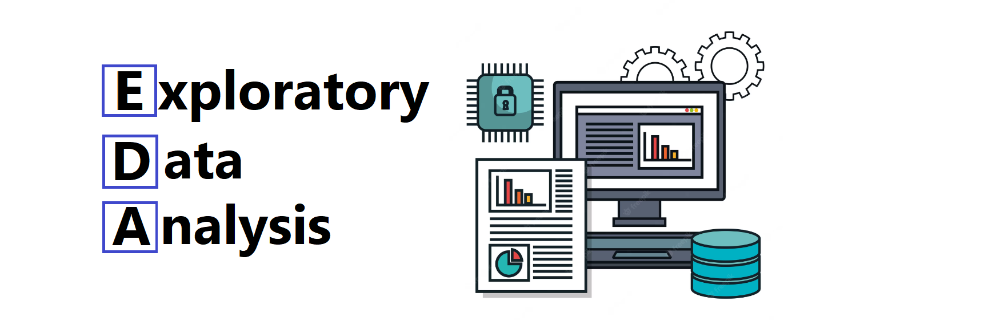

# <h1 align="center">  </h1>

## **Descripción del Proyecto**

Este proyecto analiza el crecimiento de la industria de telecomunicaciones en Argentina, y busca mejorar el acceso a Internet en las provincias argentinas y comprender su impacto en la economía y la sociedad centrándose en diferentes provincias del país. Utilizando conjuntos de datos proporcionados por **_ENACOM_**, exploraremos la evolución de las distintas tecnologías a lo largo de los años y su impacto en los ingresos del sector. La industria de las telecomunicaciones desempeña un papel vital en la sociedad actual, facilitando la comunicación a nivel internacional y permitiendo la conexión continua, incluso en situaciones de pandemia. 
Las telecomunicaciones son la transmisión de información a través de medios electrónicos como telefonía, televisión, radio e Internet. Esta última, ha transformado la comunicación, el trabajo, el aprendizaje y el entretenimiento. En Argentina, el acceso a Internet ha experimentado un notable crecimiento, con [62,12 millones de conexiones para el año 2020](https://www.datosmundial.com/america/argentina/telecomunicacion.php). 

# <h1 align="center"> **EDA (_Exploratory Data Analysis_)**</h1>

En el siguiente archivo: [**EDA**](https://github.com/Gabrielnm7/Telecommunication-Analytics-Project/blob/main/EDA.ipynb), encontrarás un minucioso estudio que explora en profundidad los diversos conjuntos de datos extraídos de la página web oficial del Ente Nacional de Comunicaciones ([_ENACOM_](https://datosabiertos.enacom.gob.ar/home)). Podrás observar análisis meticulosos que extraen información valiosa como por ejemplo sobre el comportamiento de ingresos a lo largo de los años, así como el promedio de accesos por hogar y la evolución de las distintas tecnologías en todas las regiones del país. También podrás visualizar gráficos intuitivos y conclusiones reveladoras. Prestaremos atención a las tendencias emergentes, patrones ocultos y datos significativos que nos ayudarán a tomar decisiones informadas y estratégicas para la realización de los KPIs

# <h1 align="center"> **Dashboard**  </h1>

En el archivo [**_Dashboard_Enacom_**](https://github.com/Gabrielnm7/Telecommunication-Analytics-Project/blob/main/dashboard_enacom.pbix) vamos a encontrar un conjunto completo de gráficas y `KPIs` (Indicadores Clave de Desempeño). Este dashboard ha sido cuidadosamente diseñado para brindar una visión **clara y concisa** de los datos más relevantes relacionados con el proyecto.
En este mismo, vamos a explorar y entender rápidamente el rendimiento, avance y logros, proporcionando una herramienta invaluable para la toma de decisiones de la empresa. Cada gráfica y análisis ha sido elaborado con detalle, con el objetivo de ofrecer una visión integral y detallada de nuestro progreso hacia los objetivos establecidos.
Para visualizar el dashboard, asegúrate de contar con un equipo que tenga el nivel de software requerido para la instalacion y la aplicación Power BI descargada.
Una vez que hayas descargado Power BI, simplemente abre el archivo llamado [**_Dashboard_Enacom_**](https://github.com/Gabrielnm7/Telecommunication-Analytics-Project/blob/main/dashboard_enacom.pbix) para acceder al mismo.

## **Recursos y Fuentes de Datos**
+ [PowerBI](https://powerbi.microsoft.com/es-es/): Página web oficial de la aplicacion de Microsoft donde vas a poder descargar la aplicacions para la visualizacion del dashboard.
+ [Datasets](https://datosabiertos.enacom.gob.ar/dashboards/20000/acceso-a-internet/): Este link te llevara a la pagina web oficial del ENACOM donde podras acceder a los distintos datasets que se trabajaron en este proyecto.

# **Disclaimer**
Este proyecto fue realizado durante la etapa de Labs de la academia Soy Henry. 
De parte del equipo de Henry se quiere aclarar y remarcar que los fines de los proyectos propuestos son exclusivamente pedagógicos, con el objetivo de realizar proyectos que simulen un entorno laboral, en el cual se trabajen diversas temáticas ajustadas a la realidad. No reflejan necesariamente la filosofía y valores de la organización. Además, Henry no alienta ni tampoco recomienda a los alumnos y/o cualquier persona leyendo los repositorios (y entregas de proyectos) que tomen acciones en base a los datos que pudieran o no haber recabado. Toda la información expuesta y resultados obtenidos en los proyectos nunca deben ser tomados en cuenta para la toma real de decisiones (especialmente en la temática de finanzas, salud, política, etc.)